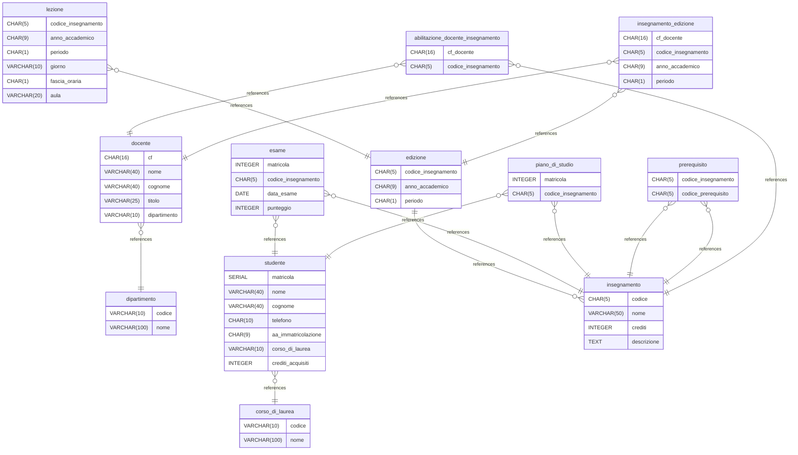

# logic_model documentation
## Summary

- [Introduction](#introduction)
- [Database Type](#database-type)
- [Table Structure](#table-structure)
	- [dipartimento](#dipartimento)
	- [corso_di_laurea](#corso_di_laurea)
	- [docente](#docente)
	- [studente](#studente)
	- [insegnamento](#insegnamento)
	- [edizione](#edizione)
	- [lezione](#lezione)
	- [esame](#esame)
	- [piano_di_studio](#piano_di_studio)
	- [prerequisito](#prerequisito)
	- [abilitazione_docente_insegnamento](#abilitazione_docente_insegnamento)
	- [insegnamento_edizione](#insegnamento_edizione)
- [Relationships](#relationships)
- [Database Diagram](#database-diagram)

## Introduction

## Database type

- **Database system:** PostgreSQL
## Table structure

### dipartimento

| Name       | Type         | Settings    | References | Note |
| ---------- | ------------ | ----------- | ---------- | ---- |
| **codice** | VARCHAR(10)  | 🔑 PK, null |            |      |
| **nome**   | VARCHAR(100) | not null    |            |      | 

### corso_di_laurea

| Name       | Type         | Settings    | References | Note |
| ---------- | ------------ | ----------- | ---------- | ---- |
| **codice** | VARCHAR(10)  | 🔑 PK, null |            |      |
| **nome**   | VARCHAR(100) | not null    |            |      | 

### docente

| Name             | Type        | Settings    | References                           | Note |
| ---------------- | ----------- | ----------- | ------------------------------------ | ---- |
| **cf**           | CHAR(16)    | 🔑 PK, null |                                      |      |
| **nome**         | VARCHAR(40) | not null    |                                      |      |
| **cognome**      | VARCHAR(40) | not null    |                                      |      |
| **titolo**       | VARCHAR(25) | not null    |                                      |      |
| **dipartimento** | VARCHAR(10) | not null    | fk_docente_dipartimento_dipartimento |      | 

### studente

| Name                    | Type        | Settings             | References                                  | Note |
| ----------------------- | ----------- | -------------------- | ------------------------------------------- | ---- |
| **matricola**           | SERIAL      | 🔑 PK, null          |                                             |      |
| **nome**                | VARCHAR(40) | not null             |                                             |      |
| **cognome**             | VARCHAR(40) | not null             |                                             |      |
| **telefono**            | CHAR(10)    | null                 |                                             |      |
| **aa_immatricolazione** | CHAR(9)     | not null             |                                             |      |
| **corso_di_laurea**     | VARCHAR(10) | not null             | fk_studente_corso_di_laurea_corso_di_laurea |      |
| **crediti_acquisiti**   | INTEGER     | not null, default: 0 |                                             |      | 

### insegnamento

| Name            | Type        | Settings    | References | Note |
| --------------- | ----------- | ----------- | ---------- | ---- |
| **codice**      | CHAR(5)     | 🔑 PK, null |            |      |
| **nome**        | VARCHAR(50) | not null    |            |      |
| **crediti**     | INTEGER     | not null    |            |      |
| **descrizione** | TEXT        | null        |            |      | 

### edizione

| Name                    | Type    | Settings    | References                            | Note |
| ----------------------- | ------- | ----------- | ------------------------------------- | ---- |
| **codice_insegnamento** | CHAR(5) | 🔑 PK, null | fk_edizione_codice_corso_insegnamento |      |
| **anno_accademico**     | CHAR(9) | 🔑 PK, null |                                       |      |
| **periodo**             | CHAR(1) | 🔑 PK, null |                                       |      | 

### lezione

| Name                    | Type        | Settings        | References                       | Note |
| ----------------------- | ----------- | --------------- | -------------------------------- | ---- |
| **codice_insegnamento** | CHAR(5)     | 🔑 PK, null     | fk_lezione_codice_corso_edizione |      |
| **anno_accademico**     | CHAR(9)     | 🔑 PK, null     |                                  |      |
| **periodo**             | CHAR(1)     | 🔑 PK, null     |                                  |      |
| **giorno**              | VARCHAR(10) | 🔑 PK, null     |                                  |      |
| **fascia_oraria**       | CHAR(1)     | 🔑 PK, null     |                                  |      |
| **aula**                | VARCHAR(20) | 🔑 PK, not null |                                  |      | 

### esame

| Name                    | Type    | Settings    | References                         | Note |
| ----------------------- | ------- | ----------- | ---------------------------------- | ---- |
| **matricola**           | INTEGER | 🔑 PK, null | fk_esame_matricola_studente        |      |
| **codice_insegnamento** | CHAR(5) | 🔑 PK, null | fk_esame_codice_corso_insegnamento |      |
| **data_esame**          | DATE    | 🔑 PK, null |                                    |      |
| **punteggio**           | INTEGER | null        |                                    |      | 

### piano_di_studio

| Name                    | Type    | Settings    | References                                   | Note |
| ----------------------- | ------- | ----------- | -------------------------------------------- | ---- |
| **matricola**           | INTEGER | 🔑 PK, null | fk_piano_di_studio_matricola_studente        |      |
| **codice_insegnamento** | CHAR(5) | 🔑 PK, null | fk_piano_di_studio_codice_corso_insegnamento |      | 

### prerequisito

| Name                    | Type    | Settings    | References                                       | Note |
| ----------------------- | ------- | ----------- | ------------------------------------------------ | ---- |
| **codice_insegnamento** | CHAR(5) | 🔑 PK, null | fk_prerequisito_codice_corso_insegnamento        |      |
| **codice_prerequisito** | CHAR(5) | 🔑 PK, null | fk_prerequisito_codice_prerequisito_insegnamento |      | 

### abilitazione_docente_insegnamento

| Name                    | Type     | Settings    | References                                                     | Note |
| ----------------------- | -------- | ----------- | -------------------------------------------------------------- | ---- |
| **cf_docente**          | CHAR(16) | 🔑 PK, null | fk_abilitazione_docente_insegnamento_cf_docente_docente        |      |
| **codice_insegnamento** | CHAR(5)  | 🔑 PK, null | fk_abilitazione_docente_insegnamento_codice_corso_insegnamento |      | 

### insegnamento_edizione

| Name                    | Type     | Settings    | References                                     | Note |
| ----------------------- | -------- | ----------- | ---------------------------------------------- | ---- |
| **cf_docente**          | CHAR(16) | 🔑 PK, null | fk_insegnamento_edizione_cf_docente_docente    |      |
| **codice_insegnamento** | CHAR(5)  | 🔑 PK, null | fk_insegnamento_edizione_codice_corso_edizione |      |
| **anno_accademico**     | CHAR(9)  | 🔑 PK, null |                                                |      |
| **periodo**             | CHAR(1)  | null        |                                                |      | 

## Relationships

- **docente to dipartimento**: many_to_one
- **studente to corso_di_laurea**: many_to_one
- **edizione to insegnamento**: one_to_many
- **lezione to edizione**: many_to_one
- **esame to studente**: many_to_one
- **esame to insegnamento**: many_to_one
- **piano_di_studio to studente**: many_to_one
- **piano_di_studio to insegnamento**: many_to_one
- **prerequisito to insegnamento**: many_to_one
- **prerequisito to insegnamento**: many_to_one
- **abilitazione_docente_insegnamento to docente**: many_to_one
- **abilitazione_docente_insegnamento to insegnamento**: many_to_one
- **insegnamento_edizione to docente**: many_to_one
- **insegnamento_edizione to edizione**: many_to_one

## Database Diagram

